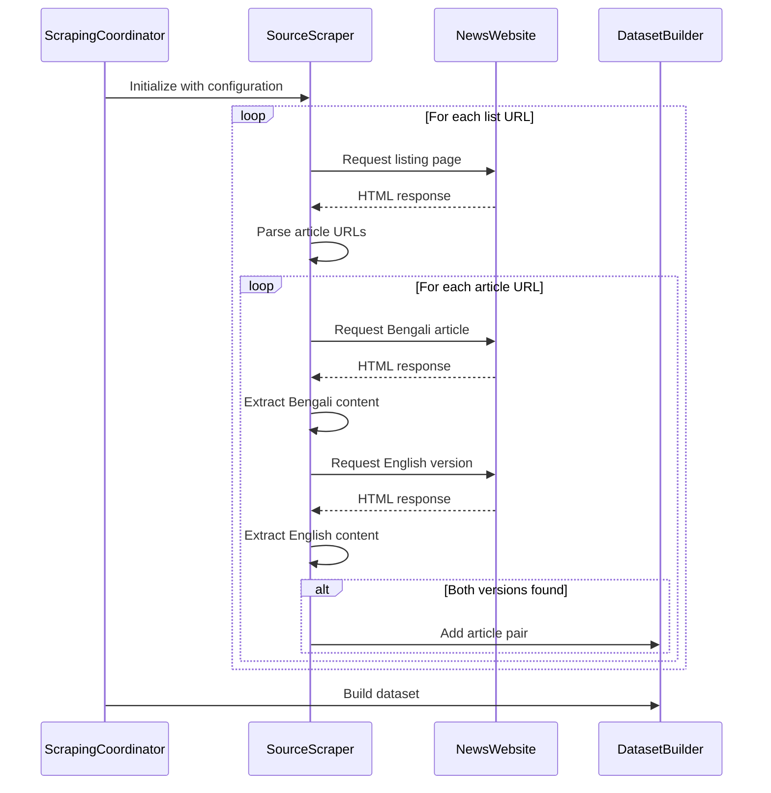

# Scraping Features

BanglaNLP provides a robust system for scraping Bengali-English news content from multiple sources. This page details the scraping architecture, supported news sources, and advanced features.

## Scraping Architecture

The scraping system follows a modular architecture:

1. **Base Scraper**: Abstract class that defines the interface for all scrapers
2. **Source-specific Scrapers**: Implementations for each news source
3. **Scraping Coordinator**: Manages and orchestrates multiple scrapers
4. **Configuration**: Central configuration of all news sources

<div class="mermaid">
graph TD
    A[ScrapingCoordinator] --> B[BaseScraper]
    B --> C[ProthomAloScraper]
    B --> D[IttefaqScraper]
    B --> E[BanglaTribuneScraper]
    B --> F[BDPratidinScraper]
    B --> G[JanakanthaScraper]
    B --> H[JaiJaidinScraper]
    A --> I[Configuration]
    A --> J[DatasetBuilder]
</div>

## Supported News Sources

BanglaNLP currently supports scraping from the following news sources:

| News Source | Website | Type | Languages |
|------------|---------|------|----------|
| Prothom Alo | https://www.prothomalo.com | Daily Newspaper | Bengali, English |
| Ittefaq | https://www.ittefaq.com.bd | Daily Newspaper | Bengali |
| Bangla Tribune | https://www.banglatribune.com | Online News | Bengali |
| BD Pratidin | https://www.bd-pratidin.com | Daily Newspaper | Bengali |
| Daily Janakantha | https://www.dailyjanakantha.com | Daily Newspaper | Bengali |
| Jai Jaidin | https://www.jaijaidinbd.com | Daily Newspaper | Bengali |

## Scraping Process

The scraping process follows these steps:

1. **Discover Article URLs**: Find links to articles from listing pages
2. **Extract Content**: Parse HTML to extract article content, title, date
3. **Language Detection**: Identify the language of the article
4. **Parallel Content**: For sources with both Bengali and English, find the corresponding article in the other language
5. **Storage**: Save the extracted content for later processing



## Advanced Features

### Rate Limiting and Politeness

The scraper implements politeness measures to avoid overloading news websites:

- Random delays between requests (1-3 seconds)
- Respects `robots.txt` directives
- User-Agent rotation
- Automatic retry with backoff for failed requests

### Error Handling

Robust error handling is implemented throughout the scraping process:

- Connection timeouts and retries
- HTML parsing error recovery
- Logging of all errors for later inspection
- Graceful continuation when article extraction fails

### Parallel Scraping

For faster scraping, you can enable parallel processing:

```python
# In main.py
coordinator.run(max_articles=1000, parallel=True, max_workers=4)
```

This uses Python's concurrent.futures to scrape multiple sources simultaneously.

### Incremental Scraping

BanglaNLP supports incremental scraping to only fetch new articles since the last run:

```bash
python main.py --incremental --last-run-file last_run.json
```

This saves state between runs and only processes new articles.

### Proxy Support

For sites that may block scrapers or to distribute request load:

```python
# In your scraper initialization
scraper = ProthomAloScraper(config, proxies={
    'http': 'http://proxy.example.com:8080',
    'https': 'https://proxy.example.com:8080'
})
```

## Custom Selectors and URL Patterns

You can customize the CSS selectors for different page elements per news source in the configuration:

```python
'prothomalo': {
    'base_url': 'https://www.prothomalo.com',
    'article_selector': 'article.story-card',
    'link_selector': 'a.link-overlay',
    'list_urls': ['/international', '/sports'],
    # Custom selectors
    'title_selector': 'h1.title',
    'content_selector': 'div.story-element p',
    'date_selector': 'time',
    'date_attr': 'datetime',  # Extract date from this attribute
    'language_detection': 'html',  # Detect language from html lang attribute
    'en_url_pattern': lambda url: url.replace('/bn/', '/en/')  # Function to convert to English URL
}
```

## Adding a New Scraper

To add support for a new news source, follow these steps:

1. Add configuration to `config.py`
2. Create a new scraper class extending `BaseScraper`
3. Implement the `extract_article` method
4. Register the new scraper in `main.py`

Example of a minimal new scraper:

```python
# newssource.py
from .base_scraper import BaseScraper
import logging

class NewSourceScraper(BaseScraper):
    def extract_article(self, url):
        soup = self.get_page(url)
        if not soup:
            return None
            
        try:
            title = soup.select_one('h1.title').text.strip()
            content = ' '.join([p.text.strip() for p in soup.select('div.content p')])
            date = soup.select_one('span.date').get_text(strip=True)
            language = 'bn'
            
            return {
                'url': url,
                'title': title,
                'content': content, 
                'date': date,
                'language': language
            }
        except Exception as e:
            logging.error(f"Error extracting from {url}: {str(e)}")
            return None
```

## Debugging Scraping Issues

To debug scraping problems, enable verbose logging and examine the HTML structure:

```bash
python main.py --debug --source prothomalo --save-html
```

This will:

1. Enable debug-level logging
2. Focus on a single source
3. Save the raw HTML for inspection

Common issues and solutions:

- **No articles found**: Check if the article selector still matches the site's HTML structure
- **Empty content**: Content selector may need updating
- **Rate limiting**: Add delays or use proxies
- **Missing date/time**: Date selector may need updating

## Next Steps

Now that you understand the scraping features, you might want to explore:

- [Filtering features](filtering.md) to ensure high-quality data
- [Dataset creation](dataset.md) to convert scraped content into a usable dataset
- [API Reference](../api/scrapers.md) for detailed implementation details
